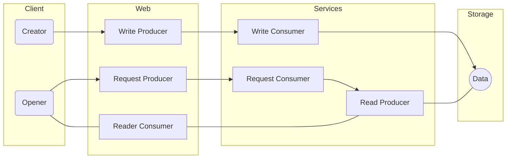

# DATA STRUCTURE

Kafka

----

## 

## NOTES

| name              | notes                                                                                                                                                                                                                     |
| ----------------- | ------------------------------------------------------------------------------------------------------------------------------------------------------------------------------------------------------------------------- |
| kafka server down | consumer: work fine without problem<br/>producer: need to know Status of server to re-send all messages                                                                                                                   |
| topic             | = trigger-id, แยก topic ตาม Main Operation Type (Request,Read(Stream),Write)                                                                                                                                              |
| partition         | partition key = ระบุ Message Queue ด้วยหมายเลข<br/>จำนวน Partition กำหนดขณะที่สร้าง Topic                                                                                                                                 |
|                   | replication = กำหนด Partition Factor ขณะที่สร้าง Topic                                                                                                                                                                    |
| record-key        | ใช้เป็น Opearation subtype ID (ProjectFileType)                                                                                                                                                                           |
| record-value      | JSON Formatted is work fine (Object > String(JSON) > Byte[])<br/>Java Serialize is work fine (Object > Byte[](JavaSerial))                                                                                                |
| consumer-group-id | group id เดียวกันจะมีเพียง 1 consumer ที่ได้รับ message สำหรับทำ load balancing<br/><br/>เฉพาะกรณี Writer มีการประมวลผลข้อมูลนาน ก่อนจะบันทึกผลลัพธ์<br/>และกรณี Reader มีการประมวลผลข้อมูลนาน ก่อนจะตอบสนองผลลัพธ์กลับไป |

## 

## MESSAGE FLOW



###### 

## CONFIGURATION

| Producer/Consumer | property                  | production                                                  | dev                                                         |
| ----------------- | ------------------------- | ----------------------------------------------------------- | ----------------------------------------------------------- |
| All Producers     | key.serializer            | org.apache.kafka.common.serialization.StringDeserializer    | org.apache.kafka.common.serialization.StringDeserializer    |
|                   | key.serializer.encoding   | UTF-8                                                       | UTF-8                                                       |
| All Consumers     | key.deserializer          | org.apache.kafka.common.serialization.StringDeserializer    | org.apache.kafka.common.serialization.StringDeserializer    |
|                   | key.deserializer.encoding | UTF-8                                                       | UTF-8                                                       |
| Write Producer    | value.serializer          | com.tflow.kafka.ObjectSerializer                            | com.tflow.kafka.JSONSerializer                              |
| Write Consumer    | value.deserializer        | com.tflow.kafka.ObjectDeserializer                          | com.tflow.kafka.JSONDeserializer                            |
| Request Producer  | value.serializer          | com.tflow.kafka.ObjectSerializer                            | com.tflow.kafka.JSONSerializer                              |
| Request Consumer  | value.deserializer        | com.tflow.kafka.ObjectDeserializer                          | com.tflow.kafka.JSONDeserializer                            |
| Read Producer     | value.serializer          | com.tflow.kafka.ObjectSerializer                            | com.tflow.kafka.JSONSerializer                              |
| Read Consumer     | value.deserializer        | org.apache.kafka.common.serialization.ByteArrayDeserializer | org.apache.kafka.common.serialization.ByteArrayDeserializer |

### 

## PRODUCER METRICS

| cases                                      | statistic values                                     | remark                                                 |
| ------------------------------------------ | ---------------------------------------------------- | ------------------------------------------------------ |
| create producer when **server still down** | creationCount = 0<br/>closeCount = 0                 |                                                        |
| create producer when **server is up**      | creationCount = 1, 2, ...<br/>closeCount = 0         |                                                        |
| check producer after **server is down**    | creationCount = 2, 3, ...<br/>closeCount = 1, 2, ... |                                                        |
| check producer when **server is back**     | creationCount = 2, 3, ...<br/>closeCount = 1, 2, ... | :car: need to find difference between 'server is down' |

## 

## Group List Write Command

> **Kafka-Topic:** UpdateGroupList, UpdateProjectList
> 
> **Note:** write process will read from data-file to data-record and update data-record by message-record before write to data-file.
> 
> **Required:** Client-ID

| record-key                            | data structure | remark |
| ------------------------------------- | -------------- | ------ |
| :car: need opeartion for group-list   |                |        |
| :car: need opeartion for project-list |                |        |

## 

## Project Write Command

> **Kafka-Topic:** <u>project-write</u>
> 
> **Note:** write process will read from data-file to data-record and update data-record by message-record before write to data-file.
> 
> **Kafka-Record-Detail:** already defined in [Data Structure - project.md](C:\Users\prazi\Documents\GitHub\TFlow\documents\Data Structure - project.md)

## 

## Project Read Command

> **Kafka-Topic:** <u>project-read</u>
> 
> **Note:** read process will read from data-file to serialized-string(similar to message in Project Write Command) and create 2 messages as Header(client-id with record-key) and Content(serialized-string with record-key).

## 

> **Kafka-Topic:** <u>project-data</u>
> 
> **Note:** client receive data after send project read command.

## 

## Kafka Record Value

### for Project Write Command, Project Read Command : Data

```json
// ### Message Record Value is Serialized String of this structure.
{
    object: "serialized-object",
    additional:
    { 
        /* Parent Field Group: all fields are optional */
        projectId: "String",
        stepId: "String",
        dataTableId: "String",
        transformTableId: "String",

        /* Transaction Field Group: all fields are required */
        modifiedClientId: int,
        modifiedUserId: int,

        /* Generated Field Group: generate by service */
        createdClientId: int,     // copy from modifiedClientId when create
        createdUserId: int,
        createdDate: Date,
        modifiedDate: Date,       // server date
    }
}
```

### 

### for Project Read Command : Header

```json
// ### Message Record Value is Serialized String of this structure.
// ### code >= 0 = clientId
// ### code < 0 = KafkaErrorCode(Enum)
{
    code: int
}
```

### 

### for Group List Write Command, Group List Read Command

### for Project List Write Command, Project List Read Command

## 

## Kafka Record Keys

| data-key                        | shorten and use as record key | required field                                      |
| ------------------------------- | ----------------------------- | --------------------------------------------------- |
| project                         | PROJECT                       | + project-id                                        |
| db-list                         | DB_LIST                       | + project-id                                        |
| sftp-list                       | SFTP_LIST                     | + project-id                                        |
| local-list                      | LOCAL_LIST                    | + project-id                                        |
| step-list                       | STEP_LIST                     | + project-id                                        |
| db                              | DB                            | + project-id                                        |
| sftp                            | SFTP                          | + project-id                                        |
| local                           | LOCAL                         | + project-id                                        |
| step                            | STEP                          | + project-id<br/>+ step-id                          |
| data-table-list                 | DATA_TABLE_LIST               | + project-id<br/>+ step-id                          |
| tower                           | TOWER                         | + project-id<br/>+ step-id                          |
| floor                           | FLOOR                         | + project-id<br/>+ step-id                          |
| line-list                       | LINE_LIST                     | + project-id<br/>+ step-id                          |
| line                            | LINE                          | + project-id<br/>+ step-id                          |
| data-file                       | DATA_FILE                     | + project-id<br/>+ step-id                          |
| data-table                      | DATA_TABLE                    | + project-id<br/>+ step-id<br/>+ data-table-id      |
| data-table-column-list          | DATA_COLUMN_LIST              | + project-id<br/>+ step-id<br/>+ data-table-id      |
| data-table-output-list          | DATA_OUTPUT_LIST              | + project-id<br/>+ step-id<br/>+ data-table-id      |
| data-table-column               | DATA_COLUMN                   | + project-id<br/>+ step-id<br/>+ data-table-id      |
| data-table-output               | DATA_OUTPUT                   | + project-id<br/>+ step-id<br/>+ data-table-id      |
| transform-table                 | TRANSFORM_TABLE               | + project-id<br/>+ step-id<br/>+ transform-table-id |
| transform-table-column-list     | TRANSFORM_COLUMN_LIST         | + project-id<br/>+ step-id<br/>+ transform-table-id |
| transform-table-trasnform-list  | TRANSFORMATION_LIST           | + project-id<br/>+ step-id<br/>+ transform-table-id |
| transform-table-output-list     | TRANSFORM_OUTPUT_LIST         | + project-id<br/>+ step-id<br/>+ transform-table-id |
| transform-table-column          | TRANSFORM_COLUMN              | + project-id<br/>+ step-id<br/>+ transform-table-id |
| transform-table-column-function | TRANSFORM_COLUMNFX            | + project-id<br/>+ step-id<br/>+ transform-table-id |
| transform-table-transformation  | TRANSFORMATION                | + project-id<br/>+ step-id<br/>+ transform-table-id |
| transform-table-output          | TRANSFORM_OUPUT               | + project-id<br/>+ step-id<br/>+ transform-table-id |

----

-- end of document --
