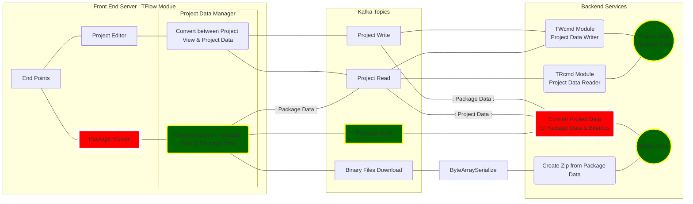
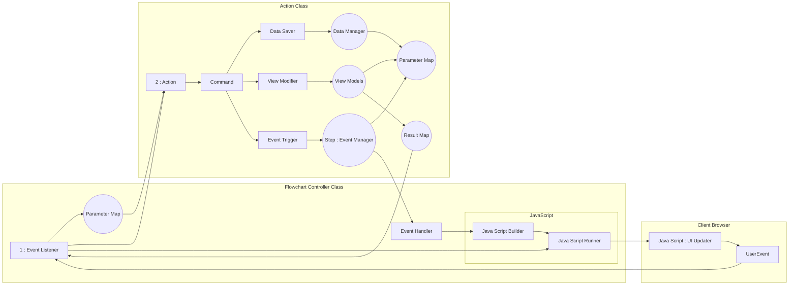
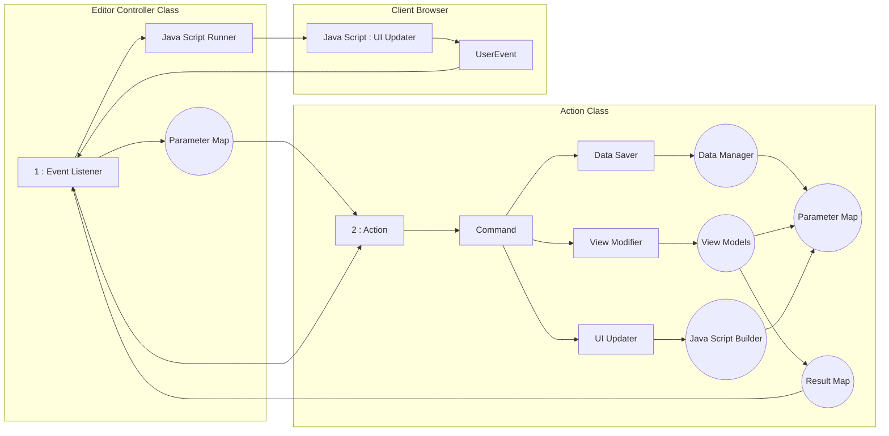

# INFRA STRUCTURE

----

## TFlow Original

```mermaid
graph LR;

classDef active fill:lightgreen,stroke:darkblue,stroke-width:7px;

subgraph Client
manager[Administrator<br/>Web Browser]
client[Users in Group 1<br/>Web Browser]
client3[Users without Group<br/>Web Browser]
client2[Users in Group 2<br/>Web Browser]
end

subgraph TFLOW<br/>

    subgraph Phase 1
    front[Editor<br/>Front End]
    kafka[Kafka]
    write(Write Command Service)
    read(Read Command Service)
    end

    subgraph Phase 1 Expansion in High Traffic
    front2[Editor<br/>Front End]
    balance[Load Balancing]
    kafka2[Kafka]
    write2(Write Command Service)
    read2(Read Command Service)
    end

    subgraph Phase 3
    manage[Administrator<br/>Front End]
    admin(Adminstrator Service)
    db((System DB))
    end

    subgraph Data
    nas((System NAS))
    end

end

subgraph User Network

    subgraph Phase 4
    ldap((User LDAP))
    end

    subgraph Phase 2
    userDB((User DB))
    userFTP((User FTP))
    end

end

manager---manage;
client---front;
client3---balance;
client2---front2;
balance---front;
balance---front2

manage---admin;
front---admin;
front---kafka;
front---kafka;
front2---kafka2;
front2---kafka2;

kafka---read;
kafka---write;
kafka2---read2;
kafka2---write2;

read----userDB
read----userFTP

admin---db;
admin---ldap;

read---nas;
write---nas;
read2---nas;
write2---nas;
```

### Add Package System

> **Package Data** : contain information for viewer and index to real binary files
> 
> **Binary Data** :  contain binary files that depends on the Package-Type
> 
> **Package-Type** : or Project-Type is group of possible DataFile-Types(Input/Ouput)
> 
> **1st** : Batch Processing (batch/shell file) : Data Tuple Inputs, Data Tuple Outputs
> 
> + **Test Project (easy) : data migration from SCT Project : require Uploaded DataFile(sql) : (optional:visual sql editor)**
>   
>   + sql input file
>   
>   + md input file
>   
>   + sql output file
>   
>   + md output file
> 
> + Test Project (advanced) : ETL from LH Bank ETL Project
> 
> 2nd : Kafka Service : Kafka Consumer Input, Kafka Producer JSON Output, Kafka Producer XML Output
> 
> + Test : try to create Project Data Writer using Kafka Service Project
> 
> + Test : try to create Project Data Reader using Kafka Service Project
> 
> 3rd : Web Service : Http Request Input, Json Output, XML Output
> 
> + Test : try to create Project Data Reader using Web Service Project and need some change to Swtich between Kafka & WebService
> 
> 4rd : Data Input UI, Html Output (for report or read only viewer) : require Input Validation



## TECHNOLOGIES

| Tier                            | Description                                                | Technology                                                                                                                                                                                                                          |
| ------------------------------- | ---------------------------------------------------------- | ----------------------------------------------------------------------------------------------------------------------------------------------------------------------------------------------------------------------------------- |
| Front End: Editor               | TFlow Editor                                               | + :white_check_mark: Primefaces                                                                                                                                                                                                     |
| Front End: Administrator Tools  | TFlow Administrator                                        | + :white_check_mark: Primefaces                                                                                                                                                                                                     |
| Message Pipeline                | Topic: Write Message Queue,<br />Topic: Read Message Queue | + :white_check_mark: Apache Kafka<br />    \|____ Zookeeper (Later: Hadoop,Spark)                                                                                                                                                   |
| Back End: Write Command Service | Write Command Queue Manager<br />Write Command<br />       | + :white_check_mark: REST Service (Json Provider)<br />+ :white_check_mark: Concurrency Utils (Thread & Queue)<br />+ [...] Apache Common IO (File Utils)<br />+ [...] Crypto (CipherOutputStream)<br />~~+ [cancelled] Micronout~~ |
| Back End: Read Command Service  | Data Provider (Read Command)                               | + REST Service (Json Provider)<br />+ [...] Apache Common IO (File Utils)<br />+ [...] Crypto (CipherInputStream)<br />~~+ [cancelled] Micronout~~                                                                                  |
| Back End: Administrator Service | Administrator Service & URL Provider                       | + REST Service (Json Provider)<br />+ [...] Crypto (user/password/token)<br />+ [...] Micronout                                                                                                                                     |

## ADVANTAGE

| Technology | Why to use it                                                                                                                                                                                                                                                                                                                                                                                                                                                                                                                                                                                                                                                                                   |
| ---------- | ----------------------------------------------------------------------------------------------------------------------------------------------------------------------------------------------------------------------------------------------------------------------------------------------------------------------------------------------------------------------------------------------------------------------------------------------------------------------------------------------------------------------------------------------------------------------------------------------------------------------------------------------------------------------------------------------- |
| Micronaut  | please read: [Introduction to Micronaut](https://docs.micronaut.io/latest/guide/index.html#introduction)<br />Notice: It is preprocessors that create classes and methods at the compile time.<br />+ Serverless (micro service) : can run directly from command-line without Web Server like jBoss<br />+ Easy to use with Kafka<br />     > map topic to function name<br />     > auto create Serializer for any Object type <br /><br />more interesting:<br />+ [Micronaut Data (with hibernate)](https://micronaut-projects.github.io/micronaut-data/latest/guide/)<br />+ [More support by Micronaut Framework](https://micronaut.io/docs/)<br/>**found big issue about Gradle Plugins** |
| Kafka      | please read: Introduction to Kafka<br />+ Need to know about this technology (used in the bank(transaction), netflix(streaming)...what?)<br />+ Need to learn a new Design Pattern 'Asyncronous Event Driven' <br />+ Can create many queue under the Topics.<br />+ Can plug/connect more than one Front End (producers)<br />+ Can plug/connect more than one Back End (consumers)<br />+ any consumers called MicroService and it can start/stop without impacting to other services                                                                                                                                                                                                         |
| Hadoop     |                                                                                                                                                                                                                                                                                                                                                                                                                                                                                                                                                                                                                                                                                                 |
| Spark      |                                                                                                                                                                                                                                                                                                                                                                                                                                                                                                                                                                                                                                                                                                 |

## 

## UI UPDATER (Current)

> **Event Usage**: Update Client-UI using client-JavaScript.
> 
> Because command has no knowleadge about JavaScript, command only known about Data-Models and View-Models.



## UI UPDATER (cancelled)

> Cancelled by Tear Concept: Command has no knowleadge about JavaScript, command only known about Data-Models and View-Models.



## Encryption

| data                                | description                                                                     |
| ----------------------------------- | ------------------------------------------------------------------------------- |
| User.name                           | Need to encrypt immediately after entered using Authentication Encryption Class |
| User.password                       | Need to encrypt immediately after entered using Authentication Encryption Class |
| Database.user<br/>SFTP.user         | Need to encrypt immediately after entered using DConvers Encryption Class       |
| Database.password<br/>SFTP.password | Need to encrypt immediately after entered using DConvers Encryption Class       |

----

-- end of document --
